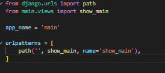
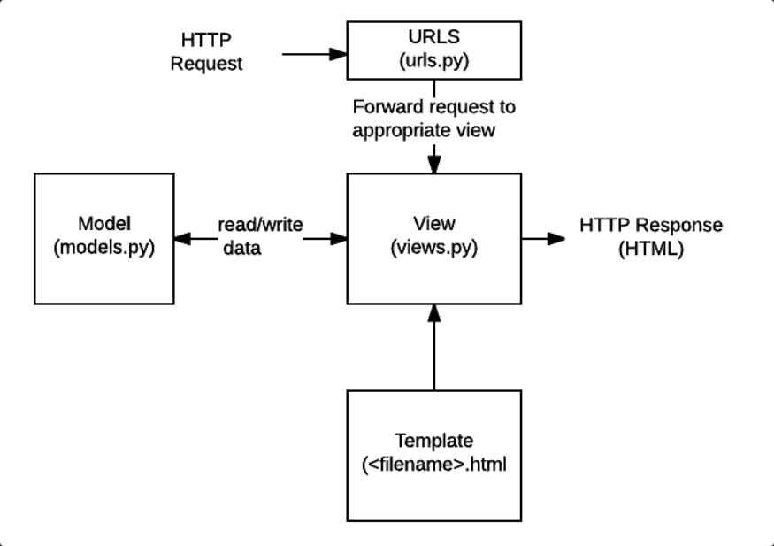

Link pws: https://ahmad-haikal41-weballinshops.pbp.cs.ui.ac.id/
1. Jelaskan bagaimana cara kamu mengimplementasikan checklist di atas secara step-by-step (bukan hanya sekadar mengikuti tutorial).
    1) Sebelum membuat proyek django, saya melakukan beberapa hal terlebih dahulu, yaitu membuat python env dulu dengan python -m venv env, lalu menjalankannya dengan env\Scripts\activate di dalam direktori proyek. Setelahnya, saya membuat requirements yang dibutuhkan dalam proyek django di dalam requirements.txt dan akan dijalankan dengan pip install -r requirements.txt. Terakhir, baru saya menjalankan proyek django dengan nama weballinshops melalui perintah "django-admin startproject weballinshops ."
    2) Pada direktori proyek, saya menjalankan virtual environment dan membuat aplikasi main pada direktori proyek dengan perintah "python manage.py startapp main" yang akan membuat direktori aplikasi baru, yaitu main. Hal yang harus dilakukan selanjutnya adalah menghubungkan aplikasi ke proyek, melalui settings.py dalam proyek weballinshops, dan di dalamnya tambahkan 'main' di variabel INSTALLED_APPS sehingga aplikasi sekarang sudah terhubung.
    3) Proses routing diawali dengan menambahkan beberapa kode di urls.py dalam direktori aplikasi main, seperti berikut:
        from django.urls import path
        from main.views import show_main
        app_name = 'main'
        urlpatterns = [
            path('', show_main, name='show_main'),
        ]
    Setelahnya, kita juga perlu mengubah urls.py yang ada di direktori proyek weballinshops, dengan menambahkan impor include dari django.urls dan menambah perintah "path('', include('main.urls'))" pada variabel urlpatterns
    4) Dalam pembuatan model, saya membuat Product(models.model) pada file models.py yang ada di dalam direktori main, lalu menambahkan atribut seperti berikut:
        name = models.CharField(max_length=255)
        price = models.IntegerField()
        description = models.TextField()
        thumbnail = models.URLField(blank=True, null=True)
        category = models.CharField(max_length=20, choices=CATEGORY_CHOICES, default='update')
        is_featured = models.BooleanField(default=False)
    Lalu, saya membuat dan melakukan migrasi karena untuk mengupdate perubahan pada model.
    5) Pada aplikasi main, di file views.py saya membuat fungsi yang nantinya ditampilkan ke template html
    
    
    6) Saya membuat routing pada urls.py dalam aplikasi main, seperti berikut
     sehingga nantinya akan memetakan fungsi yang dibuat ke views.py
    7) Saya melakukan deployment ke pws dengan melakukan beberapa perintah berikut:
        git remote add pws <link-pws>
        git branch -M master
        git add .
        git commit -m "Deployment PWS"
        git push origin master
        git push pws master

2. Buatlah bagan yang berisi request client ke web aplikasi berbasis Django beserta responnya dan jelaskan pada bagan tersebut kaitan antara urls.py, views.py, models.py, dan berkas html.

Penjelasan:
     1) Pengguna mengakses url suatu web, hal ini akan melakukan request pada URLS. 
     2) URLS akan meneruskan request dari pengguna, ke views
     3) Views.py akan memroses request dari pengguna dan menampilkan hasil requestnya berupa html. Selain itu, views.py juga dapat mengakses models untuk memenuhi request dari pengguna.
     4) models.py secara sederhana dapat dikatakan sebagai database tempat ditentukannya struktur suatu aplikasi.
     5) html, tampilan yang nantinya akan dilihat oleh pengguna
     refrensi: https://medium.com/@sundaram.2911/an-introduction-to-django-b17b51e3a7dc

3. Jelaskan peran settings.py dalam proyek Django!
Peran settings.py adalah sebagai tempat utama mengatur proyek django. Di dalam file tersebut, kita mengatur database, informasi dasar mengenai konfigurasi proyek seperti hosts yang dapat menjalankan proyek django

4. Bagaimana cara kerja migrasi database di Django?
migrasi database di Django bekerja dengan menghubungkan model pada models.py dan database aplikasi. Ketika pengembang membuat model baru ataupun mengubah model yang sudah ada perlu dilakukan "makemigrations" untuk membuat berkas migrasi yang berisi perubahan yang belum diaplikasikan ke basis data. Kemudian perintah "migrate" untuk mengaplikasikan perubahan model yang ada di dalam berkas migrasi ke dalam basis data.

5. Menurut Anda, dari semua framework yang ada, mengapa framework Django dijadikan permulaan pembelajaran pengembangan perangkat lunak?
Memiliki dokumentasi yang jelas, komunitasnya luas, pola MTV yang ada di dalamnya, dan skalabilitasnya yang baik.

6. Apakah ada feedback untuk asisten dosen tutorial 1 yang telah kamu kerjakan sebelumnya?
tutorial 1 memiliki tutorial yang sangat jelas sehingga mudah untuk diikuti, dan penjelasan tiap langkahnya memberi pemahaman yang baik mengenai Django.

TUGAS 3
1. Jelaskan mengapa kita memerlukan data delivery dalam pengimplementasian sebuah platform? 
Data delivery menjadi penting karena berguna untuk memberikan informasi yang tepat mengenai data yang kita buat supaya akurat sesuai dengan kriteria yang kita inginkan, memberikan kemudahan mengakses data ketika kita membutuhkannya, dan memudahkan untuk mendeteksi saat terjadi error.

2. Menurutmu, mana yang lebih baik antara XML dan JSON? Mengapa JSON lebih populer dibandingkan XML?

JSON lebih populer dibandingkan XML karena JSON memberika fleksibilitas yang lebih baik dari XML, lebih compact, dan lebih mudah untuk ditulis dan dibaca oleh pengembang.

3. Jelaskan fungsi dari method is_valid() pada form Django dan mengapa kita membutuhkan method tersebut?
Fungsi dari method .is_valid() pada objek form adalah untuk memvalidasi data, dan me-return boolean saat datanya valid. Method ini penting supaya form yang dibuat sesuai dengan aturan di dalam forms.

4. Mengapa kita membutuhkan csrf_token saat membuat form di Django? Apa yang dapat terjadi jika kita tidak menambahkan csrf_token pada form Django? Bagaimana hal tersebut dapat dimanfaatkan oleh penyerang?
csrf_token dibutuhkan untuk melindungi platform yang kita buat dari serangan CSRF. Jika tidak terdapat csrf_token akan menyebabkan platform kita menjadi lebih rentan dari serangan CSRF. Penyerang akan mengecoh user atau browser dengan membuat HTTP request kepada web yang rentan pada CSRF melalui malicious site, karena kerentanan tersebut penyerang akan mendapat kredensial pengguna lainnya yang seharusnya tidak terjadi jika terdapat csrf.